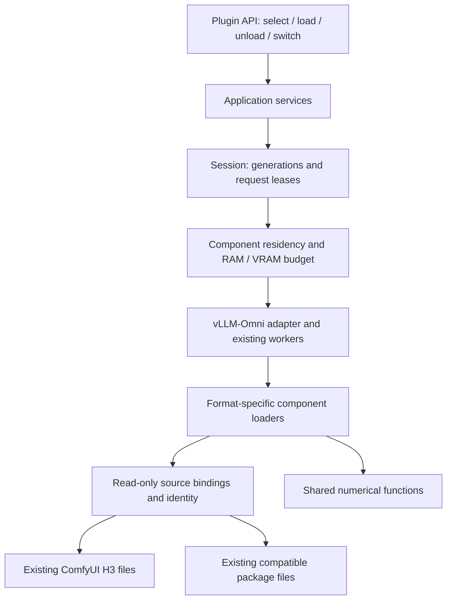

# H3 runtime architecture

The [current plan](../post-merge-refactoring-plan.md) limits the first delivery to reusing existing
H3/ComfyUI model files and loading, unloading, sharing and switching components in RAM/VRAM.
Nodes, graph execution, complete LoRA and tool support are later extensions.
This diagram is the target; [current capability](../user-guide.md) remains narrower.



A source binding describes existing files, their roles, identities, representation and configuration.
An existing package is one source kind, not a required preparation workflow. A loader supplies tensors
or native quantized objects the pinned host can consume under an explicit peak-memory budget.
It does not invoke a disk exporter or materialize another complete model.

The session holds model generations and request leases. Residency is component-level: unchanged
text encoders, VAEs and tokenizers can be shared across model choices. In-flight requests retain their
components; switching drains requests, prepares or unloads under budget, commits only a complete new
state, invalidates relevant caches and recovers the previous usable state on failure. Normal compatible
H3 switching uses the existing workers; reconstruction is a separately reported recovery/fallback.

Keep the existing dependency direction:

```text
core -> domain / contracts / artifacts -> conversion / runtime
     -> application -> CLI / API / integrations
```

The layer on the right may depend on the layer on the left. Generic runtime code must not require a
concrete integration-specific exported-package binding. Share numerical functions without coupling
runtime loading to file publication. Plugin import stays lightweight.

Future node operations will use the same component handles and leases. No graph engine or visual
editor is required for the current delivery. The old package-first architecture files and procedures
have been deleted; only necessary source attribution and valid runtime evidence remain.
